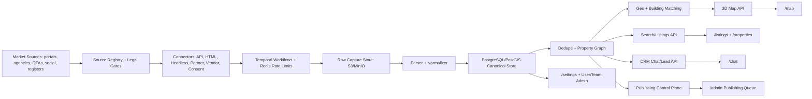

# Bulgaria Real Estate Platform MVP: Cursor-Agent Technical Build Plan

## 1. Summary
Build a full Bulgaria real estate MVP that ingests all documented market sources, normalizes and deduplicates listings, stores photos and descriptions, shows listings in a scrolling feed and 3D map, manages leads in a CRM chat inbox, supports settings/personal info, and later publishes back to authorized channels.

The current repo is a foundation only: it has `README.md`, `data/source_registry.json`, `sql/schema.sql`, `src/bgrealestate/*`, artifacts, and unit tests, but it does not yet have persistent PostgreSQL/PostGIS runtime, real tier-1 connectors, fixtures, Temporal workers, frontend pages, CRM database, or real publishing adapters. The next agent must extend the scaffold, not replace it.

## 2. Tooling
Use Cursor as the main IDE/agent, with portable repo rules so Codex and Claude can also work safely.

| Category | Use | Link |
|---|---|---|
| Cursor Project Rules | Primary Cursor guidance in `.cursor/rules/*.mdc`; preferred over legacy `.cursorrules` | [Cursor Rules](https://docs.cursor.com/en/context/rules) |
| Cursor `AGENTS.md` | Cross-agent fallback instructions in Markdown | [Cursor Rules / AGENTS.md](https://docs.cursor.com/context/rules-for-ai) |
| Cursor MCP | Connect project tools through `.cursor/mcp.json`; CLI and editor share MCP config | [Cursor MCP](https://docs.cursor.com/en/context/mcp) |
| Cursor CLI | Terminal agent runs with `cursor-agent` | [Cursor CLI](https://cursor.com/en-US/cli) |
| Cursor Background Agents | Remote async work with `.cursor/environment.json` | [Cursor Background Agents](https://docs.cursor.com/en/background-agents) |
| Cursor Bugbot | PR review rules in `.cursor/BUGBOT.md` | [Cursor Bugbot](https://docs.cursor.com/en/bugbot) |
| Codex CLI | Focused terminal patches, review, test loops | [openai/codex](https://github.com/openai/codex) |
| Claude Code | Long-context planning and refactors | [anthropics/claude-code](https://github.com/anthropics/claude-code) |
| Aider | Optional git-aware patching | [Aider](https://github.com/Aider-AI/aider) |
| Continue | Optional open-source coding assistant | [Continue](https://github.com/continuedev/continue) |
| Cline | Optional approval-first autonomous coding extension | [Cline](https://github.com/cline/cline) |
| Roo Code | Optional multi-mode coding agent | [Roo Code](https://github.com/RooCodeInc/Roo-Code) |
| OpenHands | Optional isolated autonomous dev environment | [OpenHands](https://github.com/All-Hands-AI/OpenHands) |

Project skills to create as repo files: `real-estate-source-registry`, `scraper-connector-builder`, `parser-fixture-qa`, `postgres-postgis-schema`, `workflow-runtime`, `dedupe-entity-resolution`, `geo-map-3d`, `crm-chat-inbox`, `publishing-compliance`, `frontend-pages`, `docs-export`, `qa-review-release`.

Store skills in `agent-skills/<name>/SKILL.md`; mirror to `.claude/skills/<name>/SKILL.md` if using Claude; use `.cursor/rules/<name>.mdc` as Cursor’s reliable version-controlled instruction format.

Recommended extensions: [Python](https://github.com/microsoft/vscode-python), [Ruff VS Code](https://github.com/astral-sh/ruff-vscode), [Ruff CLI](https://github.com/astral-sh/ruff), [ESLint](https://github.com/microsoft/vscode-eslint), [Prettier](https://github.com/prettier/prettier-vscode), [YAML](https://github.com/redhat-developer/vscode-yaml), [Docker](https://github.com/microsoft/vscode-docker), [SQLTools](https://github.com/mtxr/vscode-sqltools), [PostgreSQL](https://github.com/microsoft/vscode-pgsql), [Playwright](https://github.com/microsoft/playwright-vscode), [GitHub PRs](https://github.com/microsoft/vscode-pull-request-github), [GitLens](https://github.com/gitkraken/vscode-gitlens), [Code Spell Checker](https://github.com/streetsidesoftware/vscode-spell-checker).

Recommended MCP servers: [Context7](https://github.com/upstash/context7) for current library docs, [Playwright MCP](https://github.com/microsoft/playwright-mcp) for browser/source inspection, [MCP reference servers](https://github.com/modelcontextprotocol/servers) for filesystem/git/fetch/time helpers, and read-only PostgreSQL MCP for schema inspection only.

## 3. Stack
Backend: Python 3.12+, FastAPI, Pydantic v2, SQLAlchemy 2.0, Alembic, asyncpg or psycopg3, Temporal Python SDK, Redis, structlog, OpenTelemetry, Sentry.

Storage: PostgreSQL 17+/18 with PostGIS 3.5+, `pg_trgm`, JSONB + GIN indexes, GiST spatial indexes, full-text `tsvector`, optional `pgvector` later, S3 or MinIO for raw captures and media.

Scraping: httpx for HTTP/API, Playwright for JS/headless sources, selectolax or lxml for parsing, BeautifulSoup fallback, extruct/custom JSON-LD extraction, tenacity, phonenumbers, price-parser, dateparser, rapidfuzz, Pillow, imagehash.

Frontend: Next.js App Router, TypeScript, TanStack Query, MapLibre GL JS, deck.gl, Tailwind or one chosen component system, WebSockets or SSE for CRM updates.

Docs/devops: Docker Compose, Makefile, pytest, ruff, mypy or pyright, Mermaid, Mermaid CLI, Pandoc, LibreOffice headless, GitHub Actions or local CI.

## 4. Sources
Every source from the research docs must be in `source_registry` with `source_family`, `owner_group`, `tier`, `access_mode`, `risk_mode`, `freshness_target`, `publish_capable`, `dedupe_cluster_hint`, `legal_mode`, and `mvp_phase`.

| Tier | Sources | Rule |
|---|---|---|
| 1 | `OLX.bg`, `Homes.bg`, `alo.bg`, `imot.bg`, `BulgarianProperties`, `Address.bg`, `SUPRIMMO`, `LUXIMMO`, `property.bg`, `imoti.net` | Build first; API/HTML first; headless only where necessary |
| 2 | `Bazar.bg`, `Imoti.info`, `realestates.bg`, `Domaza`, `Indomio.bg`, `Realistimo`, `Home2U`, `Yavlena`, `Holding Group Real Estate`, `Rentica.bg`, `Svobodni-kvartiri.com`, `Pochivka.bg`, `Vila.bg`, `ApartmentsBulgaria.com`, `Unique Estates`, `Lions Group`, `Imoteka.bg` | Add after tier-1 fixtures and parser gates |
| 3 | `Airbnb`, `Booking.com`, `Vrbo`, `Flat Manager`, `Menada Bulgaria`, `AirDNA`, `Airbtics`, `Property Register`, `KAIS Cadastre`, `BCPEA property auctions` | Partner/API/vendor/official-service only where required |
| 4 | Telegram public channels/groups, X public accounts/search, Facebook public pages/groups where accessible, Instagram public business/profile sources, Threads public profiles if workable, Viber opt-in communities, WhatsApp Business/opt-in groups | Lead-intelligence overlays only; consent-gated where private |

Default cadence: start hourly, then promote only proven high-yield tier-1 sources to 10-minute runs after parser success, block rate, and cost metrics are stable.

Airbnb, Booking, WhatsApp, Viber private groups, and KYC/account workflows must not depend on unauthorized scraping or automatic mass account creation. Use official partner routes, authorized account linking, vendor data, or assisted manual onboarding.

## 5. Architecture


### 5.1 Parallel execution architecture

Execution is parallel by default across specialist lanes, with dependency gates between slices (not between whole phases).

| Lane | Primary owner | Scope | Parallel rule | Gate/handoff |
|---|---|---|---|---|
| Persistence + API core | `backend_developer` | migrations, repos, API contracts, workflow runtime | can run in parallel with connector fixture work | unblocks DB-backed ingest, auth, and frontend integration |
| Tier-1/2 scraping | `scraper_1` | marketplace/classifieds/agency connectors | runs in parallel with backend and UI planning | must pass fixture tests + legal gates before live-safe runs |
| Tier-3 partner/vendor/official | `scraper_t3` | partner feeds, licensed data, official-service wrappers | runs in parallel as contract-first lane | must enforce contract-required adapters and block unauthorized crawling |
| Tier-4 social overlays | `scraper_sm` | consent/official API social lead overlays | runs in parallel as policy-first lane | requires consent checklist, redaction, and legal verification |
| Operator/frontend | `ux_ui_designer` | `/admin`, `/listings`, `/map`, `/chat`, `/settings` | runs in parallel against stable API contracts | backend contract changes require synchronized UI adjustments |
| Verification + safety | `debugger` | acceptance gates, safety audit, CI parity | runs continuously across all lanes | controls `VERIFIED` status and blocker routing |

Parallel scheduling constraints:

1. Keep one active slice per agent.
2. Run independent slices concurrently (`GO all`) when dependencies are clear.
3. Promote only slices that pass acceptance gates to `VERIFIED`.
4. Refresh dashboard state after task/journey/doc changes (`make dashboard-doc`).

## 6. Database
Use PostgreSQL/PostGIS as the source of truth. Store binaries in S3/MinIO, not in Postgres. Use monthly partitions for `raw_capture`, `source_listing_snapshot`, `listing_event`, `lead_message`, and `webhook_event`.

| Area | Tables | Required Purpose |
|---|---|---|
| Sources | `source_registry`, `source_endpoint`, `source_legal_rule` | Source definitions, endpoint templates, legal/compliance gates |
| Crawl | `crawl_job`, `crawl_cursor`, `crawl_attempt`, `raw_capture`, `parser_fixture` | Durable crawl state, retries, saved payloads, fixture tests |
| Listings | `source_listing`, `source_listing_snapshot`, `canonical_listing` | Native listing ID, versioned parsed state, normalized current listing |
| Properties | `property_entity`, `property_offer`, `property_attribute`, `property_description`, `price_history`, `listing_event` | Deduped property graph, sale/rent/STR offers, facts, text, lifecycle |
| Media | `media_asset`, `property_media`, `raw_file`, `media_processing_job` | Photos, object keys, hashes, thumbnails, screenshots, PDFs |
| Contacts | `organization`, `person_contact`, `contact_method`, `property_contact_link` | Agencies, brokers, owners, developers, phones, emails, messenger handles |
| Geo | `address`, `building_entity`, `building_match`, `city_area`, `map_tile_cache` | Geocoding, building footprints, confidence scores, city/resort polygons |
| Users | `app_user`, `organization_account`, `team_membership`, `permission_grant`, `service_account`, `api_key`, `audit_log` | Login profile, teams, roles, automation keys, immutable audit |
| CRM | `conversation_channel_account`, `lead_contact`, `lead_thread`, `lead_thread_property_link`, `lead_message`, `message_attachment`, `thread_assignment_event`, `task_reminder`, `saved_reply_template`, `webhook_event` | Full chat folder/CRM inbox with assignments and follow-ups |
| Publishing | `distribution_profile`, `channel_capability`, `channel_mapping`, `publish_job`, `publish_attempt`, `onboarding_session`, `compliance_flag` | Publish eligibility, dry-run, external IDs, sync state, onboarding |

Canonical listing minimum fields: source, external ID, source URL, sale/rent/STR/auction intent, property type, city/district/resort/region, raw address, lat/lon, geocode confidence, building/project name, area, rooms, floor, floors total, construction type/year/stage, Act 16, amenities, price/currency/fees/price per sqm, agency/broker/owner/developer, phones, messenger handles, title, summary, full description, image URLs, image hashes, first seen, last seen, last changed, removed at, parser version, raw capture reference, compliance flags.

Indexes: GiST on geometry, GIN on JSONB, GIN on `tsvector`, trigram on normalized names/addresses/contact values, B-tree on source/status/timestamps/channel/assignee IDs.

## 7. Backend
Workflows must be Temporal-based and idempotent: `SourceDiscoveryWorkflow`, `ListingDetailWorkflow`, `ListingEnrichmentWorkflow`, `MediaProcessingWorkflow`, `SocialLeadIngestionWorkflow`, `ConversationSyncWorkflow`, `PublishWorkflow`, `DocExportWorkflow`.

APIs to expose: `/sources`, `/crawl-jobs`, `/parser-failures`, `/listings`, `/listings/{id}`, `/properties/{id}`, `/properties/{id}/history`, `/properties/{id}/media`, `/map/viewport`, `/map/buildings/{id}`, `/map/tiles/{z}/{x}/{y}.mvt`, `/crm/threads`, `/crm/threads/{id}/messages`, `/crm/templates`, `/me`, `/settings/team`, `/settings/api-keys`, `/settings/channel-accounts`, `/publishing/capabilities`, `/publishing/profiles`, `/publishing/jobs`, `/publishing/channel-mappings`.

Make commands to create: `make install`, `make db-init`, `make migrate`, `make test`, `make lint`, `make typecheck`, `make run-api`, `make run-worker`, `make run-scheduler`, `make run-frontend`, `make export-docs`, `make connector-fixtures SOURCE=homes_bg`.

## 8. Frontend
App routes must be built in this order: `/listings`, `/properties/[id]`, `/map`, `/chat`, `/settings`, `/admin`.

MVP geographic scope rule:

- **Map + listings browse** (`UX-04`, LUN-style homepage/`/map` feed) is **nationwide Bulgaria** (all regions/cities; user can narrow by filter/bbox).
- **3D building extrusion** and OSM building mesh for extruded heights remain **Varna city + Varna region only** in MVP (`UX-07`, `BD-08`).
- Expansion of **building-match depth** and 3D mesh to additional cities is blocked until stage-1 scraping quality is verified across required product types (`sale`, `long_term_rent`, `short_term_rent`, `land`, `new_build`) by debugger (`DBG-05`).

| Route | Components | Acceptance |
|---|---|---|
| `/listings` | `ListingsPageShell`, `ListingsFilterSidebar`, `ListingsSortBar`, `InfiniteListingFeed`, `ListingCard`, `ListingCardGallery`, `SourceBadge`, `FreshnessBadge`, `DedupeGroupBadge` | Infinite scroll, filters, sorting, photo preview, source links, create-lead action |
| `/properties/[id]` | `PropertyHeader`, `PhotoGallery`, `PriceBox`, `PropertyFactsGrid`, `DescriptionTabs`, `SourceLinksPanel`, `ContactPanel`, `MapMiniPanel`, `PriceHistoryChart`, `LeadActionPanel` | One deduped property view across all sources with provenance |
| `/map` | `MapShell`, `MapToolbar`, `MapSearchBox`, `MapFilterPanel`, `MapLibreCanvas`, `DeckBuildingLayer`, `ListingClusterLayer`, `PropertyPinLayer`, `BuildingSummaryDrawer`, `ListingPreviewCard` | 2D/3D toggle, viewport loading, clusters, listing pins **nationwide**; 3D extrusion **Varna pilot** where building tiles exist; 2D fallback elsewhere |
| `/chat` | `ChatInboxLayout`, `ThreadList`, `ThreadFilters`, `ConversationPane`, `MessageComposer`, `LeadProfilePanel`, `LinkedPropertiesPanel`, `TaskReminderPanel`, `SavedReplyPicker`, `AssignmentMenu`, `AuditTimeline` | Threads, messages, assignment, reminders, templates, manual notes, property/contact links |
| `/settings` | `ProfileSettings`, `NotificationSettings`, `TeamSettings`, `ApiKeySettings`, `ConnectedChannelsSettings`, `CrawlerSettings`, `PublishingSettings`, `SecurityAuditLog` | User profile, team roles, API keys, channel accounts, crawler/publishing state |
| `/admin` | `SourceHealthDashboard`, `CrawlerJobTable`, `ParserFailureQueue`, `DuplicateReviewQueue`, `GeocodeReviewQueue`, `ComplianceReviewQueue`, `PublishQueue`, `SyncStatusTable` | Operators can review source health, parser failures, dedupe, building matches, compliance, publishing |

## 9. Roadmap
1. Documentation and agent foundation. Inputs: PDFs, `deep-research-report.md`, current scaffold. Tools: Cursor, Codex, Claude, Context7. Skills: `docs-export`, `real-estate-source-registry`, `qa-review-release`. Outputs: `platform-mvp-plan.md`, DOCX/PDF, Mermaid diagram, `.cursor/rules`, `AGENTS.md`. Gate: docs preview cleanly and all sources are listed.

2. Database and migrations. Inputs: proposed schema and current `sql/schema.sql`. Tools: Cursor, Codex, PostgreSQL inspection, Docker. Skills: `postgres-postgis-schema`. Outputs: Alembic migrations, SQLAlchemy models, repository layer, Docker Compose for Postgres/PostGIS/Redis/MinIO/Temporal. Gate: `make db-init`, `make migrate`, `make test`.

3. Workflow runtime. Inputs: repositories, source registry, Temporal config. Tools: Cursor, Codex, Context7. Skills: `workflow-runtime`, `qa-review-release`. Outputs: workflows, workers, scheduler, retries, idempotency, rate-limit state. Gate: jobs survive worker restart and cursors persist.

4. First connector. Inputs: `Homes.bg` fixtures and legal rule. Tools: Cursor, Playwright MCP, Codex. Skills: `scraper-connector-builder`, `parser-fixture-qa`. Outputs: connector interface, discovery parser, detail parser, raw capture persistence, canonical output tests. Gate: no live network calls in tests.

5. Tier-1 connector batch. Inputs: `OLX.bg`, `alo.bg`, `imot.bg`, `BulgarianProperties`, `Address.bg`, `SUPRIMMO`, `LUXIMMO`, `property.bg`, `imoti.net`. Tools: Cursor, Playwright MCP, Context7. Skills: `scraper-connector-builder`, `publishing-compliance`. Outputs: at least 3 tier-1 end-to-end connectors, one incremental cursor. Gate: parser success above 95% on fixtures.

6. Media pipeline. Inputs: parsed image URLs. Tools: Cursor, Codex. Skills: `parser-fixture-qa`, `dedupe-entity-resolution`. Outputs: S3/MinIO image storage, hashes, thumbnails, `media_asset`, `property_media`. Gate: duplicate images detected and DB stores only metadata.

7. Dedupe graph. Inputs: listings, contacts, photos, price, area, addresses. Tools: Cursor, Codex. Skills: `dedupe-entity-resolution`. Outputs: property graph, duplicate candidates, merge confidence, review status. Gate: precision target above 0.90 on labeled Bulgarian sample.

8. Geospatial layer. Inputs: coordinates, addresses, city polygons, OSM/EUBUCCO/cadastre where permitted. Tools: Cursor, Codex, PostGIS. Skills: `geo-map-3d`. Outputs: geocoder adapter, building matcher, confidence scores, nationwide listing map coverage, priority city coverage for building depth. Gate: **Listing/map browse** supports **all Bulgaria**; **building mesh + 3D extrusion MVP** is Varna city/region first; only after stage-1 scrape verification can building-match depth expand to Sofia, Burgas, Sunny Beach/Nessebar, Bansko.

9. Search and map APIs. Inputs: property graph, offers, media, building matches. Tools: Cursor, Codex. Skills: `geo-map-3d`, `frontend-pages`. Outputs: listing search, filters, facets, viewport API, building summary API, optional MVT. Gate: search p95 under 300 ms and map p95 under 500 ms on seeded data.

10. Listings and detail UI. Inputs: listing APIs and media. Tools: Cursor, Codex, Playwright. Skills: `frontend-pages`. Outputs: `/listings` and `/properties/[id]`. Gate: infinite scroll, filters, source badges, photo gallery, create-lead action.

11. 3D map UI. Inputs: viewport/building APIs. Tools: Cursor, Playwright MCP, Context7. Skills: `geo-map-3d`, `frontend-pages`. Outputs: `/map` with MapLibre and deck.gl. Gate: 3D works where geometry exists; 2D fallback works elsewhere.

12. CRM backend and chat UI. Inputs: users, contacts, listings, channel accounts. Tools: Cursor, Codex. Skills: `crm-chat-inbox`. Outputs: CRM tables, APIs, `/chat`, manual channel mode, webhook event persistence. Gate: operator can create, assign, reply, follow up, and audit threads.

13. Settings and accounts. Inputs: auth/team/API key/channel state. Tools: Cursor, Codex. Skills: `frontend-pages`, `crm-chat-inbox`. Outputs: `/settings`, API keys, team roles, connected channels, notification settings. Gate: profile/team/channel state works with audit log.

14. Compliance gates. Inputs: source legal rules and channel capabilities. Tools: Cursor, Codex. Skills: `publishing-compliance`, `real-estate-source-registry`. Outputs: runtime blockers and review reasons. Gate: partner-only/consent-only sources cannot be used unsafely.

15. Reverse publishing. Inputs: approved distribution profiles. Tools: Cursor, Codex, Context7. Skills: `publishing-compliance`. Outputs: dry-run adapters, Booking/Airbnb official-route interfaces, Bulgarian portal capability matrix, channel mappings, reconciliation. Gate: no automatic mass account creation; external IDs sync back.

16. Admin UI. Inputs: source health, parser failures, dedupe, geo, compliance, publish jobs. Tools: Cursor, Codex, Playwright. Skills: `frontend-pages`, `qa-review-release`. Outputs: `/admin`. Gate: public launch blocked until operator queues work.

17. Final docs/export. Inputs: implemented state and acceptance results. Tools: Cursor, Codex, Claude, Mermaid, Pandoc, LibreOffice. Skills: `docs-export`. Outputs: `platform-mvp-plan.md`, `platform-mvp-plan.docx`, `platform-mvp-plan.pdf`, rendered block scheme. Gate: docs include source matrix, DB structure, app pages, agent automation setup, and numbered plan.

### 9.1 Parallel roadmap execution rule

Roadmap items are ordered for dependency clarity, but execution should be parallelized whenever slice dependencies allow:

- Wave A (parallel): docs/rules stability, DB control plane, tier-1/2 fixture connectors, tier-3 policy/contracts, social policy/contracts.
- Wave B (parallel): DB-backed ingest runners, stats/admin expansion, auth/RBAC, tier-3 adapter stubs, frontend operator dashboard binding.
- Wave C (parallel): dedupe/geo/media, map/listing/chat UI depth, publishing dry-run controls, CI hardening.

Use `docs/agents/TASKS.md` dependency graph as the real execution scheduler.

## 10. Testing
Use fixture tests for crawlers; never require live network for CI parser tests.

Required tests: migration tests, repository tests, connector fixture tests, parser encoding/blocked-page tests, media hash tests, dedupe scoring tests, geocode/building match tests, search/filter tests, map viewport tests, CRM thread/message/reminder tests, settings/API-key tests, compliance blocking tests, publishing dry-run/reconciliation tests, frontend Playwright tests for `/listings`, `/properties/[id]`, `/map`, `/chat`, `/settings`, `/admin`.

Stability targets: tier-1 fixture parser success above 95%, duplicate precision above 0.90, search p95 below 300 ms, map p95 below 500 ms, CRM inbox p95 below 300 ms, publish dry-run success above 98%, zero lost jobs after worker restart.

## 11. Agent Setup

This is the dedicated setup plan for Cursor/Codex/Claude agent automation.

### 11.1 Specialist Agents (6 roles) and Coordination Protocol
In addition to the lead agent, operate 6 specialist agents. Each specialist keeps an append-only journey log:

- `docs/agents/debugger/JOURNEY.md`
- `docs/agents/backend_developer/JOURNEY.md` (data engineer / backend structure)
- `docs/agents/ux_ui_designer/JOURNEY.md` (frontend, operator-first)
- `docs/agents/scraper_1/JOURNEY.md` (tier-1/2 marketplace websites)
- `docs/agents/scraper_t3/JOURNEY.md` (tier-3 vendor/partner/official routes)
- `docs/agents/scraper_sm/JOURNEY.md` (tier-4 social overlays, consent/official-only)

**Coordination protocol** (full details in `docs/agents/README.md`):

- **Task queue**: `docs/agents/TASKS.md` is the single source of truth for what each agent does next. Every slice has: agent, status, inputs, acceptance gate, outputs, verifier, and dependencies.
- **Cross-verification**: no slice is marked complete until a verifier agent (usually `debugger`) runs the acceptance gate and logs PASS/FAIL in their own JOURNEY.md. Status flow: `TODO` → `IN_PROGRESS` → `DONE_AWAITING_VERIFY` → `VERIFIED` or `BLOCKED`.
- **Dependency chains**: agents cannot start slices whose dependencies are not yet `VERIFIED`. The dependency graph is documented in TASKS.md.
- **Review rules**: debugger is the default verifier; backend_developer and scraper_1 cross-verify each other on DB persistence and API contracts; `.cursor/BUGBOT.md` priorities apply to all verification.

Every task slice assigned to a specialist agent must specify:

- inputs (files to read)
- acceptance gate (tests/commands)
- outputs (DB rows + XLSX export where applicable)
- verifier (which agent runs the acceptance gate)
- dependencies (which slices must be `VERIFIED` first)

1. Create `AGENTS.md` at repo root. It must say: extend existing scaffold, never replace wholesale, use PostgreSQL/PostGIS, use fixtures for crawler tests, enforce source legal rules, no unsafe social/private scraping, no automatic mass account creation, update progress after every phase.

2. Create `.cursor/rules/00-project.mdc`. Use `alwaysApply: true`. Include architecture defaults, phase gates, output template, and current repo paths.

3. Create scoped Cursor rules. Use `.cursor/rules/backend.mdc` for `src/bgrealestate/**`, `.cursor/rules/frontend.mdc` for `web/**`, `.cursor/rules/scrapers.mdc` for `src/bgrealestate/connectors/**`, `.cursor/rules/database.mdc` for `sql/**` and `migrations/**`, `.cursor/rules/docs.mdc` for docs/export work.

4. Create `.cursor/mcp.json`. Add Context7 for docs, Playwright MCP for browser inspection, GitHub if the repo is connected, and PostgreSQL MCP only as read-only. Do not commit secrets; use `${env:...}` interpolation.

5. Create `.cursor/environment.json` for Background Agents. Include install commands such as `make install`, startup support for Docker if needed, and terminals such as `make run-api`, `make run-worker`, and `make run-frontend` only after those commands exist and are stable.

6. Create `.cursor/BUGBOT.md`. Tell Bugbot to prioritize scraper legal gates, SQL injection, auth/RBAC, workflow idempotency, raw data privacy, accidental live-network tests, and frontend state bugs.

7. Create `agent-skills/<skill>/SKILL.md` for every skill listed in Section 2. Each skill should include when to use it, files to read first, commands to run, acceptance gate, and output format.

8. Use Cursor Background Agents only for bounded tasks. Good background tasks: one connector with fixtures, one frontend page, one migration slice, one review queue. Bad background tasks: “build the whole platform,” live scraping without review, account automation, or anything requiring secrets.

9. Use Cursor foreground Agent for sensitive tasks. Sensitive tasks: legal gate changes, source policy changes, publishing adapters, channel credentials, auth/API keys, and database migrations touching user/chat data.

10. Use Codex for focused patches and reviews. Good Codex prompts: “review this connector for unsafe live network tests,” “implement one migration,” “add fixture tests for Homes.bg parser,” “review publishing compliance blockers.”

11. Use Claude Code for long-context docs/refactors. Good Claude prompts: “synchronize `platform-mvp-plan.md` with the schema and source matrix,” “extract agent skills from the plan,” “review whether all sources from the research report are represented.”

12. Every agent step must end with this output:
```text
Changed files:
Agent tools used:
Skills used:
Extensions/libraries used:
Commands run:
Tests run:
Outputs produced:
Risks / blockers:
Progress update:
Next step:
```

## 12. Operator Dashboard Spec

The dashboard is the operating system for the project. It lets an operator create a market-monitoring project, choose compliant source packs, see scraper and database readiness, watch milestone progress, and move directly into source health, map, CRM, and publishing review.

### 12.1 Dashboard layout zones

| Zone | Content | Data source |
|---|---|---|
| Top health strip | Postgres, Redis, API, worker, scheduler, object storage | `/api/v1/ready` |
| KPI row | Enabled sources, live-safe sources, canonical listings, crawl failures, parser failures, duplicate-review count, CRM open threads | `/admin/source-stats` + future endpoints |
| Left navigation | Project setup, Sources, Crawl jobs, Parser failures, Dedupe review, Geocode review, CRM, Publish queue, Settings | UI navigation |
| Main work area | Switchable tables, map panels, drawers, project forms | Per-panel endpoints |
| Right context drawer | Raw metadata, legal notes, source config, audit trail, retry actions | Detail endpoints |

### 12.2 Project creation flow

| Step | Name | Required inputs | Validations | Resulting state |
|---|---|---|---|---|
| 1 | Define project identity | Project name, team owner, country/city/resort focus, property intents | Name unique, at least one intent selected | Project draft created |
| 2 | Pick source packs | Tier-1 portals, agencies, vendor feeds, registers, approved social overlays | At least one source selected | Sources attached to project |
| 3 | Review compliance | Legal mode, access mode, risk mode, publish allowed per source | No source violates legal mode or requires missing partner route | Compliance gate passed |
| 4 | Configure cadence | Hourly vs 10-min runs, priority, fixture-only vs live-safe | At least one cadence set | Cadence saved |
| 5 | Set data rules | Dedupe sensitivity, geocode confidence, required fields, photo expectations | Thresholds in valid range | Data rules saved |
| 6 | Set CRM routing | Default owner, inbox rules, note templates, reminder defaults | Owner exists | CRM routing saved |
| 7 | Set milestone targets | Current phase, acceptance gate, verifier, next slice | Phase valid | Milestones saved |
| 8 | Save and launch | Environment, migration, source-gate checks | All checks green | Project activated |

### 12.3 Operator dashboard modules

| Module | Data source / API | Key KPIs | Primary actions | Backlog status |
|---|---|---|---|---|
| Source health table | `/admin/source-stats` | Canonical listings, raw captures, coverage %, legal badges | Filter, drill-down, retry | Spec ready |
| Crawl jobs table | `GET /crawl-jobs` | Running, succeeded, failed, last run | Retry, inspect metadata | Backend ready |
| Parser failure queue | `GET /parser-failures` | Failure count, failure rate | Inspect, retry, fix | Backend pending |
| Dedupe review queue | Future endpoint | Candidate count, merge confidence | Accept, reject, split | Not started |
| Geocode review queue | Future endpoint | Low-confidence count | Correct, approve, reject | Not started |
| Compliance review | `/admin/source-stats` | Blocked sources, missing partners | Review, approve, escalate | Spec ready |
| Publish queue | Future endpoint | Pending jobs, dry-run results | Publish, cancel, retry | Not started |
| CRM inbox summary | `GET /crm/threads` | Open threads, unassigned, reminders due | Assign, reply, follow up | Backend partial |
| Map preview | Future viewport API | Coverage polygons, 3D readiness | Pan, zoom, filter | Not started |

### 12.4 Dashboard delivery backlog

| ID | What to build | Status |
|---|---|---|
| Dashboard A | Project creation wizard with identity, source pack, compliance, cadence, CRM, and milestone steps | Not started |
| Dashboard B | Live health strip and KPI row from readiness plus source stats | Backend partial |
| Dashboard C | Source health table with filters, tier badges, legal badges, and drill-down | Spec ready |
| Dashboard D | Crawl jobs table with retry and metadata drawer | Backend ready |
| Dashboard E | Parser failure, dedupe review, geocode review, compliance review, and publish queue panels | Backend pending |
| Dashboard F | Map preview inside dashboard for project geography and 3D readiness | Not started |
| Dashboard G | CRM inbox summary widgets and assignment/status shortcuts | Backend partial |

### 12.5 Dashboard acceptance criteria

1. A new project cannot be activated if any selected source violates legal mode or requires a missing partner route.
2. A new project cannot be activated if migrations are missing or the registry is not synced.
3. KPI cards must match the same underlying stats that power `/admin/source-stats` and future crawl failure queues.
4. Every top-level number must open a drill-down table or drawer.
5. The milestone tracker must show who owns the next slice and which gate must pass next.

### 12.6 Report and export pipeline

The dashboard data is also exported as a static HTML dashboard (`docs/dashboard/index.html`), a JSON data file (`docs/exports/progress-dashboard.json`), parallel timeline + scraper snapshot markdown (`docs/exports/parallel-execution-timeline.md`, `docs/exports/scraper-activity-snapshot.md`), and a product summary with all metrics. Generate with `make dashboard-doc`. The export pipeline reads from `data/source_registry.json`, `docs/agents/TASKS.md`, agent `JOURNEY.md` files, and `docs/project-status-roadmap.md`. The HTML dashboard includes parallel roadmap waves (PLAN §9.1), specialist lane structure, operator phases A–G, and the full parsed task backlog.

## 13. Business Model & Unit Economics

Full analysis: `docs/business/unit-economics-market-analysis.md`
Investor presentation: `output/pdf/investor-presentation-{date}.pdf` (generate: `python3 scripts/generate_investor_presentation.py`)

### 13.1 Market sizing

| Level | Annual revenue | Basis |
|---|---|---|
| TAM (Bulgaria nationwide) | €74.7M | Agency subs + listing fees + leads + STR analytics + AI tools + developer marketing |
| SAM (Varna + Burgas coastal) | €22.6M | 28–35% coastal share of national activity |
| SOM Year 1 (Varna MVP) | €0.7–1.1M | 3–5% of SAM with 50 agency subs |
| SOM Year 3 (multi-city) | €4.5–6.8M | 20–30% coastal share |
| SOM Year 5 (national leader) | €8.0–10.0M | 35–45% market share |

### 13.2 Unit economics

| Metric | Value |
|---|---|
| Gross margin | ~80% |
| LTV (agency premium, 18 months) | €5,400 |
| CAC (blended) | €120 |
| LTV:CAC ratio | 45:1 |
| Breakeven | Month 4–5 (50 agency subscriptions) |

### 13.3 Product positioning

Buyer-oriented marketplace. Owners post directly. Agents appear as "owner representative" (never "realtor"). Platform aggregates 30+ sources with AI-powered deduplication, **nationwide map + listings browse**, **3D buildings (Varna pilot)**, and persistent AI chat assistant.

Full product UX structure: `docs/business/product-ux-structure.md`
3D map integration plan: `docs/business/varna-3d-osm-integration.md`

## 14. 3D Map Integration (Varna MVP)

Technology: MapLibre GL JS + deck.gl for 3D building extrusion. Data: OpenStreetMap Varna extract (GeoFabrik → osmium → tippecanoe → PMTiles). Buildings extruded to real height with property pins overlaid.

| Component | Owner | Status |
|---|---|---|
| OSM data pipeline | backend_developer (BD-08) | TODO |
| PostGIS building_entity | backend_developer | Schema exists |
| MapLibre 3D layer | ux_ui_designer (UX-07) | TODO |
| PMTiles serving | backend_developer | TODO |
| Blosm marketing renders | ux_ui_designer (optional) | Deferred |

Blosm (https://github.com/vvoovv/blosm) can generate static 3D renders of Varna for marketing. Not for runtime web rendering — MapLibre handles that.

## 15. Assumptions

PostgreSQL/PostGIS is the main operational database; S3/MinIO stores raw captures/photos/docs; Temporal is the durable automation layer; Cursor is the main builder; Codex and Claude are supporting agents; public UI starts only after ingestion, map data, CRM, compliance, and publishing controls are stable.

Booking.com and Airbnb stay in scope for market intelligence and reverse publishing, but only through official/authorized/vendor routes. WhatsApp, Viber, private Facebook groups, and private Telegram groups are opt-in/consent-only. Threads is experimental public-profile monitoring only unless official read/search support is confirmed during implementation.

## 16. Session Context Digest (2026-04-08)

This section preserves the full execution context and decisions from the latest orchestration session so future runs do not lose intent.

### 16.1 Strategic decisions locked in

- Execution model is parallel across specialist lanes with dependency-gated promotion to `VERIFIED`.
- Specialist roster is fixed at 6 agents: `backend_developer`, `scraper_1`, `scraper_t3`, `scraper_sm`, `ux_ui_designer`, `debugger` (+ lead agent).
- Tier ownership is strict:
  - tier-1/2: `scraper_1`
  - tier-3 partner/vendor/official: `scraper_t3`
  - tier-4 social overlays: `scraper_sm`
- **Map + listings UX** is **nationwide Bulgaria** (`UX-04`). **3D building mesh** stays **Varna-first** (`UX-07` / `BD-08`). Stage-1 quality gate (`DBG-05`) still gates expansion of **building-match / 3D** to more cities, not the nationwide browse shell.
- Social and private channels remain consent-gated; no unsafe scraping or account automation.
- Marketplace positioning is buyer-oriented: owners post directly; agency participation is framed as owner representation.

### 16.2 Operating protocol decisions

- `GO <agent>` and `GO all` are the activation controls.
- Non-stop continuation rule is now mandatory: agents continue sequentially through unblocked slices until:
  1. operator says `END`, or
  2. no unblocked slice remains, or
  3. a real blocker occurs.
- If no unblocked slice remains, agents must ask exactly:
  - `Which <agent_name> task should I execute next?`
- Recurring activation duties are mandatory:
  - read TASKS + all JOURNEY logs
  - propagate cross-agent notes into explicit slices
  - refresh dashboard/docs when state changes (`make dashboard-doc`)

### 16.3 Delivered artifacts in this session

- Business and strategy outputs:
  - `docs/business/unit-economics-market-analysis.md`
  - `docs/business/product-ux-structure.md`
  - `docs/business/varna-3d-osm-integration.md`
  - `output/pdf/investor-presentation-2026-04-08.pdf`
- Backlog/task architecture updates:
  - new lead and execution slices in `docs/agents/TASKS.md`
  - expanded backend slices for unification, analytics, photo classification, deployment, and scraper runtime
  - expanded UX slices for shop view, detail page, profile cabinet, and deployment
- Dashboard reliability fix:
  - `docs/dashboard/index.html` now supports embedded payload mode for `file://` opens
  - generator injects JSON payload into dashboard HTML and keeps fetch fallback for hosted mode

### 16.4 Current execution focus (critical path) — updated 2026-04-09

**Wave 1 — Tier-1/2 live data (non-stop):** `scraper_1` completes `S1-15` (live HTTP + discovery + detail) and **`S1-18`**: at least **100** persisted listings **per** source across **at least 5** tier-1/2 sources, counted in **`canonical_listing`** (see `docs/exports/tier12-live-volume-report.md`). Do not idle between slices until the gate is met or a **BLOCKED** reason is logged.

**Wave 1b — Minimal backend for counting:** `backend_developer` prioritizes **`BD-11`** verification and any ingest wiring required so live scrapes land in Postgres for auditable `S1-18` counts. **`BD-12`+** waits until `S1-18` is `VERIFIED` unless it unblocks ingest.

**Wave 2 — Backend expansion:** after `S1-18`, resume `BD-12` → `BD-13` → `BD-14` → `BD-15` per `docs/agents/TASKS.md`.

**Wave 3 — Debugger:** `DBG-06` (batch verify pending slices) and `DBG-05` (fixtures + live volume evidence) **after** `S1-18` and live `BD-11` proof, unless the operator explicitly requests early spot checks.

**Fixture readiness (already true):** `docs/exports/stage1-product-type-coverage.md` shows tier-1/2 fixtures cover required product types; this is **not** a substitute for the live volume gate.

### 16.5 Backlog source-of-truth links

- execution backlog and dependencies: `docs/agents/TASKS.md`
- operational guardrails and GO rules: `AGENTS.md`
- coordination protocol: `docs/agents/README.md`
- dashboard state: `docs/dashboard/index.html` + `docs/exports/progress-dashboard.json`
- live volume tracking: `docs/exports/tier12-live-volume-report.md`
- architecture export set: `docs/exports/project-architecture-execution-guide.*`
