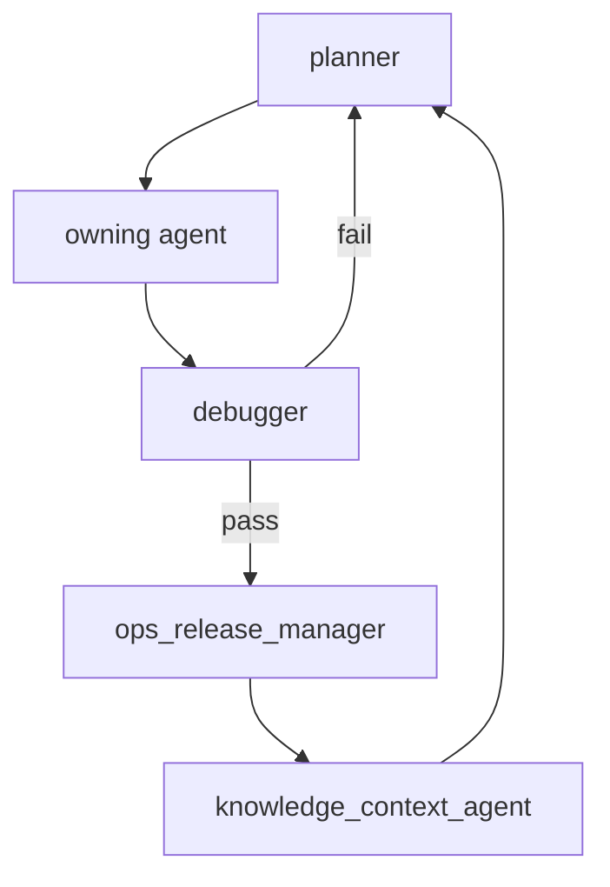

# Agent Loop And Cadence

Date: 2026-05-13

## Activation Loop

1. `planner` turns the latest prompt into one current slice.
2. The owning agent reads its role file and required project docs.
3. The owning agent executes only its slice.
4. The owning agent updates `JOURNEY.md`, `TASKS.md`, and artifacts.
5. `debugger` verifies the acceptance gate.
6. `ops_release_manager` handles git/release when needed.
7. `knowledge_context_agent` records durable memory/insights.

## Constant Agents

These agents may run continuously during active development:

| Agent | Constant trigger | Stop condition |
| --- | --- | --- |
| `planner` | Any prompt, blocker, or handoff. | No unclear owner/dependency remains. |
| `backend_developer` | DB/API/import/runtime work is unblocked. | DB/API contract is verified or blocked. |
| `scraper_1` | Action1/Action2 scraping wave or parser repair is active. | Current wave is verified or legally/runtime blocked. |
| `data_analyst` | New scrape/import artifacts exist. | Counts, anomalies, and next actions are reproducible. |
| `debugger` | Any slice reaches handoff. | PASS or explicit blocker. |

## Scheduled Or Triggered Agents

| Agent | Trigger |
| --- | --- |
| `ops_release_manager` | Every commit/push/release, CI/deploy change, or secret-risk state. |
| `infra_db_operator` | Server provisioning, DB backup/restore, migration, count verification, runtime health. |
| `ux_ui_designer` | UI contract changed, UX review requested, or frontend route needs implementation. |
| `scraper_sm` | Legal/consent-gated tier-3/tier-4 work is explicitly in scope. |
| `market_intelligence_analyst` | Weekly market review or competitor/price strategy question. |
| `user_analytics_agent` | Analytics instrumentation, funnel review, or live UX telemetry analysis. |
| `vision_media_agent` | Media batch exists or image-report schema/model changes. |
| `entity_resolution_agent` | Accepted source publications are imported and matching can be reviewed. |
| `knowledge_context_agent` | Meaningful conclusion, repeated failure, new rule, or run closeout. |

## Review Ring

## Daily Routine

1. `planner`: prune blockers and choose the next unblocked slice.
2. `scraper_1`: report A1 source/bucket deltas if scraping is active.
3. `data_analyst`: refresh accepted/grouped/LOST and media counts.
4. `backend_developer` or `infra_db_operator`: verify DB/import readiness.
5. `debugger`: run focused acceptance gates.
6. `knowledge_context_agent`: update run log and reusable memory.

## Weekly Routine

1. `market_intelligence_analyst`: market/rival changes, pricing, supply, and source strategy.
2. `user_analytics_agent`: funnel/event quality after live traffic exists.
3. `ux_ui_designer`: review user flows against market and analytics evidence.
4. `ops_release_manager`: release hygiene, open risks, CI/deploy readiness.
5. `planner`: rebuild next 1-3 execution waves.
