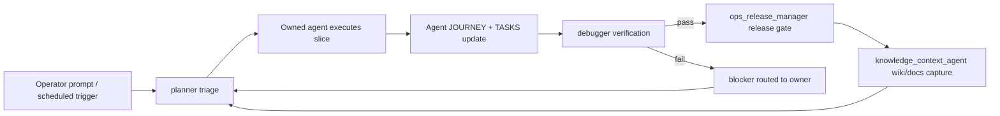

# Self-Development Agent Architecture

Date: 2026-05-13

This document is the operating architecture for finishing the Bulgaria Real Estate MVP with persistent, reviewable agent work. It extends the existing `docs/agents/TASKS.md` and `docs/agents/*/JOURNEY.md` model.

## Core Rule

Every activation follows this loop:

1. Load context: `AGENTS.md`, wiki memory/insights, `TASKS.md`, relevant `JOURNEY.md`, and the role file in `docs/agents/roles/`.
2. Convert the newest operator prompt into the current slice when it supersedes planned work.
3. Execute one owned slice without crossing legal, data, or source-tier boundaries.
4. Write outputs as repo files, not chat-only results.
5. Append `JOURNEY.md`, update `TASKS.md`, refresh dashboards when docs/tasks changed.
6. Hand off to `debugger` or another named verifier.
7. Capture durable lessons in the project wiki when the result changes future behavior.

## Team Topology

### Control Layer

| Agent | Purpose | Cadence |
| --- | --- | --- |
| `planner` | Own task graph, priorities, dependencies, phase gates, and prompt-to-slice conversion. | Every activation and after every major handoff. |
| `ops_release_manager` | Own git hygiene, commits, pushes, release notes, CI gates, and rollback instructions. | Every push/release; daily while active development is heavy. |
| `infra_db_operator` | Own server setup, Docker/runtime, PostgreSQL/PostGIS, backups, restores, migrations, and DB health reports. | Before/after migration, then daily until stable. |
| `knowledge_context_agent` | Own wiki capture, project memory, insights, docs index, and skill inventory. | After every meaningful run; weekly deep cleanup. |

### Build Layer

| Agent | Purpose | Cadence |
| --- | --- | --- |
| `backend_developer` | Own FastAPI, SQLAlchemy/Alembic, importer, API contracts, auth, CRM, and runtime correctness. | Constant while backend/API slices are unblocked. |
| `scraper_1` | Own tier-1/2 marketplace website connectors, Action1/Action2 routes, parser fixtures, and legal-gated live scraping. | Constant during scrape waves; 15-minute loop when automation is enabled. |
| `scraper_sm` | Own S&M intelligence: tier-3 vendor/official/partner routes plus tier-4 public/consent social overlays. | Triggered by legal approval or approved fixture work; never widens Action1. |
| `ux_ui_designer` | Own product structure and frontend surfaces: `/listings`, `/properties`, `/map`, `/chat`, `/settings`, `/admin`. | Triggered by stable API contracts and UX review requests. |

### Intelligence Layer

| Agent | Purpose | Cadence |
| --- | --- | --- |
| `data_analyst` | Own corpus QA, accepted/grouped/LOST counts, price/area/location anomalies, dashboard truth, and DB/file reconciliation. | After every scrape/import wave; daily during Action1. |
| `market_intelligence_analyst` | Own market and rival behavior analysis: portals, agencies, STR vendors, price trends, listing supply, competitor actions. | Weekly baseline; ad hoc when strategic decisions depend on market evidence. |
| `user_analytics_agent` | Own product telemetry design: events, funnels, UX signals, conversion metrics, privacy-safe dashboards. | Before public launch, then daily/weekly after traffic exists. |
| `vision_media_agent` | Own photo evidence, room/style/condition/equipment reports, image quality, and model uncertainty. | After media capture batches; nightly when image backlog exists. |
| `entity_resolution_agent` | Own conservative duplicate/source-publication matching and property graph candidate review. | After imports and data analyst QA; before public map/search trust claims. |

### Verification Layer

| Agent | Purpose | Cadence |
| --- | --- | --- |
| `debugger` | Own acceptance gates, fixture-only test policy, secret/legal checks, regression review, and final verification. | After every non-debugger slice. |

## Non-Negotiable Boundaries

- `data/source_registry.json` is the source matrix.
- Every source action must check `legal_mode`, `risk_mode`, and `access_mode`.
- Scraped rows are source publications first. Canonical property promotion requires single-unit evidence.
- Numeric `0` is never a real price.
- No unauthorized broad scraping for Airbnb, Booking.com, WhatsApp, Viber, private Facebook, or private Telegram.
- Tests for crawlers use fixtures, not live network.
- Public UI claims must be backed by data analyst/debugger artifacts.

## Operating Loop

## Plan B: Mixed Constant And Triggered Agents

If only a subset of agents is active:

- Keep `planner`, `debugger`, and `knowledge_context_agent` mandatory for every serious run.
- Keep `scraper_1`, `data_analyst`, and `backend_developer` in the constant loop during scraping and import work.
- Run `ops_release_manager` on every push, before server migration, and after any CI/deploy change.
- Run `infra_db_operator` only when runtime, migrations, backups, DB counts, or server setup are touched.
- Run `ux_ui_designer` when UI/API contracts change or user-facing flows need review.
- Run `market_intelligence_analyst` on a weekly cycle or before strategy/product scope decisions.
- Run `user_analytics_agent` before launch, after analytics events are changed, and after enough user traffic exists.
- Run `vision_media_agent` only after media exists locally or model/report contracts change.
- Run `entity_resolution_agent` after accepted source publications are imported and data quality is stable.

## Current Strategic Priority

FACT: Action1/A1 still has quality and media debt.

INTERPRETATION: The next development cycle should prepare server/DB migration, then continue Action1 QA/import verification, then widen to Action0/Action2 only after the operator gates.

HYPOTHESIS: A remote dedicated server with private PostgreSQL/PostGIS and object storage is the best next runtime path.

GAP: Remote SSH credentials, final provider, and live DB counts are not known yet.
