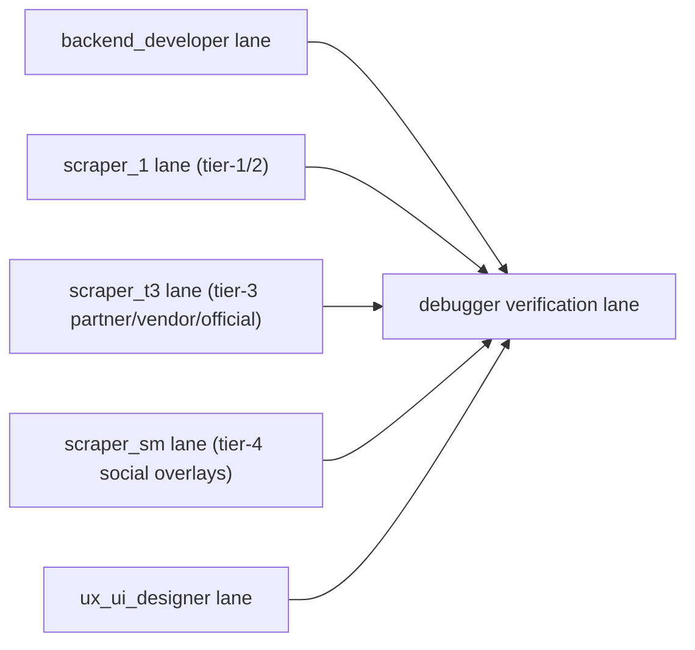
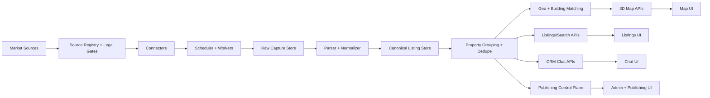

# Bulgaria Real Estate Platform Architecture And Execution Guide

Updated: 2026-04-28

## 1. Purpose

This document describes how the Bulgaria real estate platform is intended to work as a continuously running ingestion, normalization, grouping, search, CRM, and publishing system.

It is meant to be useful for:

- project owners
- operators
- Cursor/Codex/Claude agents
- backend and frontend developers
- future infrastructure and QA work

This guide complements:

- `PLAN.md`
- `platform-mvp-plan.md`
- `docs/project-status-roadmap.md`
- `data/source_registry.json`
- `sql/schema.sql`
- `docs/exports/reporting-and-instruction-index.md`
- `docs/exports/taskforgema.md`
- `docs/openclaw/gemma4-agent.md`

It also defines the execution “orchestra”:

- specialist agent journey logs in `docs/agents/*/JOURNEY.md`
- operator reporting outputs (PostgreSQL + XLSX exports)
- an operator-first internal admin surface for source health and ingestion coverage

## 1.1 Current Reporting And Instruction Pack

The repo-owned DOCX pack is generated and versioned under `docs/exports/`:

| Artifact | Purpose |
|---|---|
| `bulgaria-real-estate-source-report.docx` | Source registry, scrape/photo coverage, four-bucket pattern readiness, and agent handoff rules. |
| `project-architecture-execution-guide.docx` | System architecture, guardrails, agent execution rules, and product/frontend/backend responsibilities. |
| `project-status-roadmap.docx` | Current stage, completed work, open gates, and next execution order. |

The current four-bucket tier-1/2 scrape handoff is centered on `Address.bg`, `BulgarianProperties`, `Homes.bg`, `imot.bg`, `LUXIMMO`, `property.bg`, and `SUPRIMMO` across:

1. buy residential
2. buy commercial
3. rent residential
4. rent commercial

Gemma4/OpenClaw must consume only local listing JSON and local image files, then produce per-property image descriptions and QA reports using `docs/exports/taskforgema.md` and `docs/exports/property-quality-and-building-contract.md`.

## 2. Product Goal

The platform should become a single operational system that:

1. constantly parses the Bulgarian real estate market and related supply channels
2. stores every found listing link and listing snapshot
3. normalizes all data into a canonical schema
4. compares listings to detect the same apartment or property across multiple sites
5. groups duplicate and near-duplicate listings into one property item with multiple source variations
6. exposes a list view, property detail view, 3D map view, CRM chat/inbox, settings, and admin tools
7. later publishes approved inventory back to supported channels through official or authorized routes

## 2.1 Execution model (6 specialist agents)

In addition to the lead agent, the project runs 6 specialist agents:

1. **debugger**: reproduce failures, tighten tests, reduce flakiness
2. **backend_developer (data engineer)**: persistence, ingestion orchestration, APIs, reporting outputs
3. **ux_ui_designer (frontend)**: operator/admin UI surfaces first (public UI after ingestion foundations)
4. **scraper_1**: marketplace connectors (tier‑1 portals/agencies/classifieds), fixture-first
5. **scraper_t3**: tier-3 partner/vendor/official-route connectors (contract/licensing-first)
6. **scraper_sm**: social overlays only (official API or consent/manual only)

Each specialist appends work notes and post-execution review comments to:

- `docs/agents/debugger/JOURNEY.md`
- `docs/agents/backend_developer/JOURNEY.md`
- `docs/agents/ux_ui_designer/JOURNEY.md`
- `docs/agents/scraper_1/JOURNEY.md`
- `docs/agents/scraper_t3/JOURNEY.md`
- `docs/agents/scraper_sm/JOURNEY.md`

## 2.2 Parallel execution architecture

The architecture is intentionally parallel. Work is split into lanes that run concurrently with dependency gates:

Parallel rules:

1. One active slice per agent, many agents active at once.
2. Dependency edges are enforced at slice level (`TASKS.md`), not at whole-document phase level.
3. `debugger` continuously verifies gates and controls promotion to `VERIFIED`.
4. Dashboard artifacts are refreshed when task/journey/docs change.

Lane ownership:

| Lane | Owner | Scope |
|---|---|---|
| Persistence/API/runtime | `backend_developer` | DB, migrations, repositories, APIs, worker orchestration |
| Tier-1/2 connectors | `scraper_1` | portals/classifieds/agencies, fixture-first parsing, live-safe promotion |
| Tier-3 connectors | `scraper_t3` | partner feeds, licensed datasets, official-service wrappers |
| Tier-4 overlays | `scraper_sm` | social lead overlays, consent/redaction/legal contracts |
| Operator/UI | `ux_ui_designer` | `/admin`-first UX, then `/listings`/`/map`/`/chat`/`/settings` |
| Verification/safety | `debugger` | acceptance gates, CI parity, cross-lane safety audits |

## 3. Continuous Scraping And Update Model

The parsing layer is intended to run constantly, not as a one-time import.

### 3.1 Expected cadence

1. Start with hourly crawling for approved sources.
2. Promote stable, high-yield tier-1 sources to 10-minute cadence.
3. Keep partner/vendor/official sources on their own approved sync frequency.
4. Keep social and lead overlays slower unless they prove uniquely valuable.

### 3.1.1 Fixture-first rule (non-negotiable)

Before any source is run live, it must have:

1. offline fixtures under `tests/fixtures/<source>/`
2. parser regression tests that run with no network access
3. legal gate enforcement based on `legal_mode`, `risk_mode`, and `access_mode`

### 3.2 What must be stored for every discovered listing

For every found listing URL or listing identifier, the platform must preserve:

1. source name
2. external listing ID
3. listing URL
4. first seen timestamp
5. last seen timestamp
6. current status
7. raw capture reference
8. normalized canonical listing reference

This is the base requirement for “all found property links.”

In the current schema, this is primarily represented by:

- `source_listing`
- `source_listing_snapshot`
- `canonical_listing`

`source_listing.canonical_url` is the durable URL record for the discovered source page.

### 3.3 Constant update behavior

When scraping runs repeatedly:

1. the platform rediscovers list pages or feed items
2. it compares them against existing source listing records
3. it fetches new or changed details
4. it stores a new raw capture and listing snapshot
5. it updates the canonical listing state
6. it emits lifecycle events such as created, updated, price changed, removed, or relisted

This is how the platform becomes a living market mirror instead of a static import.

## 4. Source Coverage Strategy

The platform must keep the full source inventory defined in `data/source_registry.json`.

### 4.1 Tier 1

These are the primary ingestion targets:

- `OLX.bg`
- `Homes.bg`
- `alo.bg`
- `imot.bg`
- `BulgarianProperties`
- `Address.bg`
- `SUPRIMMO`
- `LUXIMMO`
- `property.bg`
- `imoti.net`

### 4.2 Tier 2

These are the second-wave sources to add once tier-1 quality is stable:

- `Bazar.bg`
- `Imoti.info`
- `realestates.bg`
- `Domaza`
- `Indomio.bg`
- `Realistimo`
- `Home2U`
- `Yavlena`
- `Holding Group Real Estate`
- `Rentica.bg`
- `Svobodni-kvartiri.com`
- `Pochivka.bg`
- `Vila.bg`
- `ApartmentsBulgaria.com`
- `Unique Estates`
- `Lions Group`
- `Imoteka.bg`

### 4.3 Tier 3

These require partner, vendor, or official-service treatment:

- `Airbnb`
- `Booking.com`
- `Vrbo`
- `Flat Manager`
- `Menada Bulgaria`
- `AirDNA`
- `Airbtics`
- `Property Register`
- `KAIS Cadastre`
- `BCPEA property auctions`

### 4.4 Tier 4

These are lead-intelligence overlays and must remain compliance-gated:

- public Telegram channels/groups
- public X accounts/search
- public Facebook pages/groups where accessible
- public Instagram business/profile sources
- Threads public profiles where workable
- Viber opt-in communities
- WhatsApp Business or opt-in groups

## 4.5 MVP geo scope gate (map/search)

For MVP, interactive map/search scope is restricted to:

- Varna city
- Varna region

Expansion outside Varna is blocked until stage-1 scraping is verified as complete across required product types (`sale`, `long_term_rent`, `short_term_rent`, `land`, `new_build`) and ingestion quality gates pass.

## 5. Core Architecture

## 6. Database Architecture

The database must support both raw market collection and normalized grouped property views.

### 6.1 Source and crawl control

Core tables:

- `source_registry`
- `source_endpoint`
- `source_legal_rule`
- `crawl_job`
- `crawl_cursor`
- `crawl_attempt`
- `raw_capture`
- `parser_fixture`

These control what can be scraped, how often, and under which legal mode.

### 6.2 Listing persistence

Core tables:

- `source_listing`
- `source_listing_snapshot`
- `canonical_listing`
- `listing_event`

This is the part that must always keep every found listing link and its change history.

### 6.3 Property grouping

Core tables:

- `property_entity`
- `property_offer`
- `property_attribute`
- `property_description`
- `price_history`
- `property_contact_link`

This layer is where the system stops treating every listing page as a separate item and starts treating listings as representations of a shared underlying property.

### 6.4 Media and comparison

Core tables:

- `media_asset`
- `property_media`
- `media_processing_job`

This layer is critical for next-stage grouping because photos are one of the strongest signals that two listings represent the same apartment.

### 6.5 Geo and map

Core tables:

- `address`
- `building_entity`
- `building_match`
- `city_area`

This layer powers the 3D map, building grouping, and city/resort navigation.

### 6.6 Users, CRM, and publishing

Core tables:

- `app_user`
- `organization_account`
- `team_membership`
- `conversation_channel_account`
- `lead_contact`
- `lead_thread`
- `lead_message`
- `task_reminder`
- `distribution_profile`
- `channel_mapping`
- `publish_job`
- `publish_attempt`

## 7. Property Grouping Logic

This is one of the most important next-stage system behaviors.

### 7.1 Why grouping is required

The same apartment can appear:

1. on multiple portals
2. on the agency site
3. on the developer site
4. under slightly different prices
5. with different photos or only partial photo overlap
6. with different titles or short descriptions

Without grouping, the platform becomes a duplicate feed instead of a market intelligence system.

### 7.2 Required grouping signals

The next stage must compare:

1. exact source IDs where applicable
2. address similarity
3. district and geospatial proximity
4. area and room counts
5. price bands
6. phone overlap
7. agency/broker overlap
8. description similarity
9. image hash similarity
10. building or project name

### 7.3 Target grouping result

The grouped model should look like this conceptually:

1. one `property_entity`
2. one or more `property_offer` rows
3. multiple `source_listing` rows that point to that property
4. multiple listing variations from different sites
5. one combined property detail page in the product

This allows the product to show one property item with:

- all source links
- all known prices
- all variations in descriptions
- all photos
- source provenance

## 8. Product Surfaces

### 8.1 Listings page

The `/listings` page must provide:

1. infinite scrolling feed
2. filters
3. sorting
4. source badges
5. freshness indicators
6. create-lead action
7. open-on-map action

### 8.2 Property detail page

The `/properties/[id]` page must provide:

1. grouped property view
2. gallery
3. facts grid
4. all known source links
5. price history
6. contact action
7. provenance visibility

### 8.3 3D map page

The `/map` page must provide:

1. MapLibre base map
2. deck.gl 3D building layer
3. listing clusters
4. building summaries
5. building-linked listing drawer
6. 2D fallback where geometry is weak

### 8.4 CRM chat page

The `/chat` page must provide:

1. thread list
2. conversation pane
3. linked property context
4. reminders
5. assignments
6. saved replies
7. audit trail

### 8.5 Settings page

The `/settings` page must provide:

1. personal profile
2. team settings
3. API keys
4. connected channels
5. crawler settings
6. publishing settings

### 8.6 Admin page

The `/admin` page must provide:

1. source health
2. parser failure review
3. duplicate review queue
4. geocode/building review
5. compliance review
6. publishing queue

#### Current implementation note (internal operator MVP)

The repository already includes a minimal internal admin surface (not the final UI):

- `GET /admin` (simple internal page)
- `GET /admin/source-stats` (JSON)

These are backed by PostgreSQL and intended for quick operator visibility during Stage 2–4.

## 8.7 Reporting outputs (DB + XLSX)

Every ingestion slice must produce two operator-friendly outputs:

1. **Database persistence**: the canonical store and snapshots must be queryable in PostgreSQL.
2. **XLSX exports**: daily/weekly reports for source health and coverage should be exportable to `docs/exports/`.

Current implemented export:

- `scripts/export_source_stats_xlsx.py` → `docs/exports/source-stats.xlsx`
- `scripts/generate_progress_dashboard.py` → `docs/exports/progress-dashboard.json` + `docs/dashboard/index.html`

## 8.8 Skill discovery and reuse

Agents should discover reusable project skills before coding:

1. run `make list-skills` (or `python -m bgrealestate list-skills`)
2. choose relevant skills from `agent-skills/**`
3. if missing, add a new skill and update `docs/agent-skills-index.md`

## 9. Stage-By-Stage Execution

### Stage 0

Planning, source registry, docs, and agent automation.

### Stage 1

Development environment, local run targets, validation command, Docker scaffold.

### Stage 2

Database and persistence:

1. Alembic
2. SQLAlchemy models
3. repositories
4. DB-backed verification

Recommended Stage 2 operator checks:

- `GET /api/v1/ready` (dependency readiness)
- `GET /admin/source-stats` (ingestion output visibility)
- export `docs/exports/source-stats.xlsx`

### Stage 3

Runtime and compliance:

1. legal gates
2. idempotent jobs
3. scheduler and worker design
4. retry/cursor logic

### Stage 4

Tier-1 connectors:

1. fixture-first parsing
2. one source at a time
3. persistence validation
4. only then live-source rollout

### Stage 5

Tier-2 and partner/vendor channels.

### Stage 6

Media hashing, dedupe, and property graph.

### Stage 7

Geospatial enrichment and building matching.

### Stage 8

Backend APIs for listings, map, CRM, settings, and publishing.

### Stage 9

Frontend MVP:

1. listings
2. property detail
3. map
4. chat
5. settings
6. admin

### Stage 10

Reverse publishing through official or authorized routes.

### Stage 11

QA, monitoring, pilot ingestion, operator readiness, and launch.

## 10. Setup Instructions

### 10.1 Local setup

1. Use Python 3.12.
2. Use Docker for PostgreSQL/PostGIS, Redis, MinIO, and Temporal where possible.
3. Start from:
   - `make install`
   - `make test`
   - `make validate`

If PostgreSQL is available, prefer migrations over direct SQL:

- `make dev-up`
- `make db-init`

### 10.2 Current local constraints

At the time of this document:

1. the workspace shell does not have GitHub push auth configured
2. Docker has not been validated from this shell
3. the frontend is still a static shell, not a real Next.js app
4. live DB-backed migration execution still depends on a prepared Python 3.12 runtime

## 11. Agent Usage Instructions

### Cursor

1. read `AGENTS.md`
2. read `.cursor/rules/00-project.mdc`
3. work one slice at a time
4. keep tests and docs with each change

### Codex

Use for:

1. focused patches
2. reconciliation reviews
3. DB and parsing slices
4. architecture and execution docs

### Claude

Use for:

1. long-context synthesis
2. doc reconciliation
3. roadmap-to-implementation review

## 12. Immediate Next Priority

The correct next execution priority remains:

1. finish Stage 2
2. validate real DB migration execution
3. close repository and persistence gaps
4. finish `Homes.bg` discovery and DB-backed ingestion
5. only then broaden connector coverage

## 13. Business Model & Market Analysis

Full unit economics and market analysis: `docs/business/unit-economics-market-analysis.md`
Investor presentation with charts: `output/pdf/investor-presentation-{date}.pdf`

### 13.1 TAM / SAM / SOM

| Level | Annual Revenue | Basis |
|---|---|---|
| TAM (Bulgaria) | €74.7M | Agency subs + listing fees + leads + STR + AI + developer marketing |
| SAM (coastal) | €22.6M | 28–35% coastal share |
| SOM Year 1 | €0.7–1.1M | Varna MVP, 50 agency subs |
| SOM Year 3 | €4.5–6.8M | Multi-city, 20–30% share |

### 13.2 Platform positioning

Buyer-oriented marketplace. Owners post directly. Agents are "owner representatives". 30+ sources aggregated with AI dedupe, 3D map (Varna MVP), and persistent AI chat.

Key differentiator: No existing Bulgarian portal aggregates across sources. Our platform is the first unified search with 95%+ supply coverage.

### 13.3 Go-to-market phases

| Phase | Timeline | Scope | Target |
|---|---|---|---|
| MVP | Months 1–4 | Varna, 10 tier-1 sources, 3D map, AI chat | 5K MAU, 50 agencies |
| Coastal | Months 5–8 | Burgas + resorts, 25+ sources, STR analytics | 15K MAU, 200 agencies |
| National | Months 9–14 | Sofia/Plovdiv/Bansko, CRM, publishing | 50K MAU, 500 agencies |
| International | Months 15–24 | EU buyer funnel, multi-lang, cross-border tools | 100K MAU, leader |

## 14. 3D Map Integration (Varna MVP)

Full integration plan: `docs/business/varna-3d-osm-integration.md`

Technology: MapLibre GL JS + deck.gl 3D building extrusion. Data: OpenStreetMap (GeoFabrik extract → osmium → tippecanoe → PMTiles).

| Component | Owner | Status |
|---|---|---|
| OSM data pipeline | backend_developer (BD-08) | TODO |
| PostGIS building_entity | backend_developer | Schema exists |
| MapLibre 3D layer | ux_ui_designer (UX-07) | TODO |
| PMTiles static serving | backend_developer | TODO |
| Blosm marketing renders | ux_ui_designer (optional) | Deferred |

Blosm (https://github.com/vvoovv/blosm) generates beautiful offline 3D renders for marketing. MapLibre handles runtime web rendering.

## 15. Product UX Structure

Full spec: `docs/business/product-ux-structure.md`

Core pages: `/` (map+feed split), `/properties/[id]`, `/map` (fullscreen 3D), `/chat` (AI assistant), `/new-builds`, `/analytics`, `/post` (owner submission), `/admin`.

Reference model: LUN.ua (Ukraine aggregator) adapted for Bulgaria with AI chat, 3D buildings, owner-first posting.

## 16. Summary

The platform is intended to become a continuously running market-ingestion and property-grouping system with a buyer-oriented marketplace frontend.

The critical operational ideas are:

1. scrape continuously from 30+ sources
2. keep every found source listing link
3. preserve snapshots and raw captures
4. normalize into canonical listing records
5. group duplicate apartment variations into one property entity
6. build product views on top of the grouped property graph
7. render 3D map with OSM buildings for Varna city
8. provide AI chat assistant aware of property context and map state
9. enable owner-first posting with agent-as-representative model
10. capture revenue through agency subs, premium listings, leads, STR analytics
